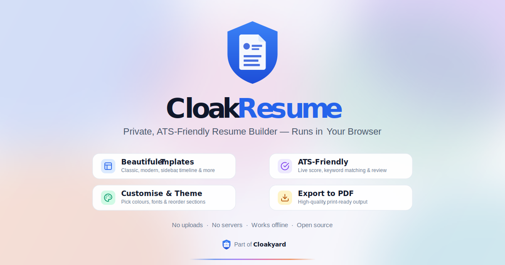

<div align="center">

  

  <p>A fast, modern, and privacy-focused resume builder that runs entirely in your browser.<br>
  No uploads, no servers, no tracking — your resume never leaves your device.</p>

  <p><strong>Try it here →</strong> <a href="https://resume.cloakyard.com/">resume.cloakyard.com</a></p>

  <p>
    
    
    <a href="https://opensource.org/licenses/MIT"></a>
  </p>
  <p>
    
    
    
  </p>

</div>

---

## ✨ Features

CloakResume is a full-featured resume builder, all running 100% client-side:

### 🎨 Templates

_Fourteen hand-crafted layouts across five design families_

| Category     | Templates                                                                                                                                                                                                                           |
| ------------ | ----------------------------------------------------------------------------------------------------------------------------------------------------------------------------------------------------------------------------------- |
| **ATS-Safe** | **ATS Professional** · single column with subtle accent. **ATS Plain** · pure black & white for the strictest parsers                                                                                                               |
| **Classic**  | **Classic Sidebar** · tinted rail with detail-rich content. **Executive Serif** · serif headings for leadership roles                                                                                                               |
| **Modern**   | **Modern Minimal** · clean single column. **Aurora** · mesh-gradient hero with a glass card. **Spotlight** · dark sidebar with hero stats. **Minimalist** · pure type with hairline accents. **Compact Timeline** · dense one-pager |
| **Creative** | **Typographic** · Swiss-style numbered sections. **DuoTone** · bold split panel with a magazine feel. **Bauhaus** · geometric colour-block editorial. **Gradient Header** · coloured banner with personality                        |
| **Academic** | **Academic CV** · scholarly layout for researchers and faculty                                                                                                                                                                      |

Switch between any template with a single click — your content stays, only the layout changes.

### 📝 Editor

_Edit every section with live inline previews_

| Feature                  | Description                                                                                          |
| ------------------------ | ---------------------------------------------------------------------------------------------------- |
| **Profile & Headline**   | Name, role tagline, and rich-text summary with bold, italic, and inline link support                 |
| **Contact Links**        | Email, phone, location, website, LinkedIn, GitHub, Twitter, Medium — each with the right icon        |
| **Experience**           | Unlimited roles with company, location, dates, and rich-text bullets                                 |
| **Education**            | Degrees, schools, dates, and free-form detail fields (e.g., CGPA, honours)                           |
| **Projects**             | Name, description, role, and tech-stack chips                                                        |
| **Skills**               | Grouped into categories with optional Lucide icons per group                                         |
| **Certifications**       | Issuer, name, and year — ordered as you like                                                         |
| **Awards**               | Recognition with year and supporting detail                                                          |
| **Languages**            | Name and proficiency level                                                                           |
| **Interests & Tools**    | Free-form chip lists for quick personality and stack signals                                         |
| **Quick Stats & Extras** | Sidebar stat blocks (e.g., "15+ years") and free-form extras (e.g., Visa status)                     |
| **Custom Sections**      | Add your own sections with a custom heading and rich-text bullets (e.g., Volunteering, Publications) |
| **Reorder Sections**     | Drag sections to change the resume's narrative order                                                 |
| **Rich Text**            | Bold, italic, and links anywhere multi-line content is allowed                                       |
| **Inline Spellcheck**    | Native browser spelling underlines on every prose field — zero dependencies, zero network            |

### 🧭 Résumé Review

_Know how your resume will be parsed and read before you send it_

| Feature                   | Description                                                                                                                        |
| ------------------------- | ---------------------------------------------------------------------------------------------------------------------------------- |
| **Two scores, one tap**   | Separate **ATS** score (structure, contact, keywords) and **Writing** score (spelling, grammar, style, readability) — each 0–100   |
| **ATS scorecard**         | Earned-vs-max points across content quality, formatting, keyword coverage, and impact & metrics                                    |
| **Writing scorecard**     | Spelling, grammar, style, and readability each scored independently via Harper (Rust grammar engine compiled to WebAssembly)       |
| **Keyword Matching**      | Paste a job description to see which keywords match and which are missing                                                          |
| **Writing details**       | Every Harper finding shown with the field it came from and the suggested fix — spot a typo, see which bullet it's in               |
| **Issues & Wins**         | Actionable suggestions alongside a summary of what you're already doing well                                                       |
| **Progress on first run** | Harper's ~7 MB WASM engine downloads once with a visible progress bar; cached forever afterwards, then every scan is instantaneous |

### 🎨 Design Controls

_Make it yours without fighting the layout_

| Feature                    | Description                                                                           |
| -------------------------- | ------------------------------------------------------------------------------------- |
| **Primary Colour**         | Pick any colour — the app derives a full palette (tints, borders, text) automatically |
| **Live A4 Preview**        | Pixel-accurate page rendered at 210 × 297 mm with pagination across multiple pages    |
| **Scaled Thumbnails**      | Template picker shows every layout with your actual content rendered to scale         |
| **Section Rail & Pills**   | Jump between sections from a floating rail on desktop or a pill bar on mobile         |
| **Bottom Sheet on Mobile** | Native-feeling drag-to-dismiss editor sheet for touch devices                         |

### 📤 Export & Persistence

_Your resume is always within reach_

| Feature                | Description                                                                       |
| ---------------------- | --------------------------------------------------------------------------------- |
| **Print to PDF**       | Browser-native print dialog produces a pixel-perfect PDF with correct page breaks |
| **JSON Import/Export** | Download your resume as JSON, edit externally, or re-import later                 |
| **Autosave**           | Every keystroke is saved to local storage — close the tab and come back anytime   |
| **Start from Sample**  | Kick off with a fully-populated lorem-ipsum resume that showcases the layout      |
| **Start Fresh**        | Or begin with a blank canvas — previews use sample data until you add your own    |

---

## 🔒 Privacy First

|                               |                                                         |
| ----------------------------- | ------------------------------------------------------- |
| **No uploads**                | Everything is processed locally in your browser         |
| **No server-side processing** | Zero network requests for your resume data              |
| **No data collection**        | No analytics, no tracking, no cookies                   |
| **Strict CSP**                | Content Security Policy blocks any unintended egress    |
| **Fully offline capable**     | Works without an internet connection after initial load |

---

## 🛠️ Tech Stack

| Category      | Technology                                                                                                             |
| ------------- | ---------------------------------------------------------------------------------------------------------------------- |
| Framework     | [React 19](https://react.dev/)                                                                                         |
| Styling       | [Tailwind CSS 4](https://tailwindcss.com/)                                                                             |
| Build Tool    | [Vite+](https://vite.dev/) (Vite + Rolldown unified toolchain)                                                         |
| Language      | [TypeScript 6](https://www.typescriptlang.org/)                                                                        |
| Icons         | [Lucide React](https://lucide.dev/)                                                                                    |
| PWA / Offline | [Workbox](https://developer.chrome.com/docs/workbox) via [vite-plugin-pwa](https://vite-pwa-org.netlify.app/)          |
| Writing Check | [Harper](https://writewithharper.com/) — a Rust grammar checker compiled to WebAssembly, running in a dedicated worker |
| Toolchain CLI | [Vite+ (`vp`)](https://viteplus.dev/)                                                                                  |

---

## 🚀 Getting Started

### Prerequisites

- **Node.js** ≥ 24.x (LTS recommended)
- **Vite+ (`vp`)** — install globally via `npm i -g vite-plus`

### Installation

```bash
# Clone the repository
git clone https://github.com/sumitsahoo/cloakresume.git
cd cloakresume

# Install dependencies
vp install

# Start the development server
vp dev
```

### Available Commands

| Command      | Description                               |
| ------------ | ----------------------------------------- |
| `vp dev`     | Start the Vite dev server with hot reload |
| `vp build`   | TypeScript check + production build       |
| `vp preview` | Preview the production build locally      |
| `vp check`   | Run format, lint, and type checks         |
| `vp test`    | Run tests                                 |

---

## 📁 Project Structure

```
cloakresume/
├── public/                  # Static assets (icons, manifest, OG image)
├── src/
│   ├── main.tsx             # App entry point
│   ├── App.tsx              # Root component & state wiring
│   ├── index.css            # Global styles & Tailwind theme tokens
│   ├── types.ts             # ResumeData, TemplateId, AtsReport types
│   ├── assets/              # Brand assets & logo
│   ├── components/          # Editor, preview, toolbar, ATS panel, modals
│   │   ├── editor/          # Per-section editors (experience, skills, …)
│   │   └── ats/             # ATS insight panes & keyword matching
│   ├── templates/           # One component per resume template
│   ├── data/
│   │   ├── sampleResume.ts  # Populated starter (lorem ipsum showcase)
│   │   └── blankResume.ts   # Empty starter for "Start fresh"
│   └── utils/               # Colour palette, ATS scoring, Harper grammar hook, rich text, storage
├── index.html               # HTML entry point + meta/OG tags + CSP
├── vite.config.ts           # Vite + Tailwind + PWA configuration
├── tsconfig.json            # TypeScript configuration
└── package.json
```

---

## ⚙️ How It Works

CloakResume is a single-page React app that keeps every resume entirely in memory and in `localStorage`.

- **Templates as components** — every layout is a plain React component that consumes the same template-agnostic `ResumeData` shape, so switching templates never rewrites your content.
- **Palette derivation** — the user picks a single primary colour, and [src/utils/colors.ts](src/utils/colors.ts) computes a full tonal palette (tints, borders, hover states) so every template stays visually coherent.
- **Live A4 pagination** — `PaginatedCanvas` measures rendered content and slices it into 210 × 297 mm pages, matching exactly what the browser will print to PDF.
- **Scaled previews** — the template picker renders each layout at full width with a CSS transform scale, using your actual resume content (or sample content when the resume is empty).
- **ATS scoring** — [src/utils/ats.ts](src/utils/ats.ts) inspects the resume shape, checks for missing sections, and matches keywords against a pasted job description — entirely client-side.
- **Writing quality** — the review modal shows a second score alongside ATS, powered by [Harper](https://writewithharper.com/) ([src/utils/grammar.ts](src/utils/grammar.ts)). Harper is a Rust grammar engine compiled to WebAssembly, running in a dedicated worker (spawned by `WorkerLinter`). On the first scan, we fetch the ~7 MB WASM with a streaming reader so the UI can show byte-level download progress, then feed Harper a blob URL so the worker can bootstrap without a second round-trip. Subsequent scans reuse the cached linter — zero network, zero re-init.
- **PDF export** — there is no PDF library bundled. The app styles a print stylesheet and defers to the browser's native print-to-PDF, which yields a pixel-accurate, selectable, ATS-parseable PDF.

All operations happen in-memory. The strict Content Security Policy in [index.html](index.html) blocks any outbound network requests for user content — it is architecturally impossible for your resume to leave your device.

---

## 🚢 Deployment

CloakResume is deployed to a static host via a CI/CD workflow on every push to `main`.

The deployment pipeline:

1. Checks out the code
2. Installs dependencies with `vp install`
3. Builds the production bundle with Vite
4. Deploys the `dist/` folder to the host

---

## 🤝 Contributing

Contributions are welcome — new templates, ATS improvements, and accessibility fixes especially. Open an issue or a pull request to get started.

---

## 📄 License

This project is licensed under the **MIT License** — feel free to use it for both personal and commercial purposes. See the [LICENSE](LICENSE) file for details.

---

<p align="center">
  Built with ❤️ by <a href="https://github.com/sumitsahoo">Sumit Sahoo</a>
</p>
