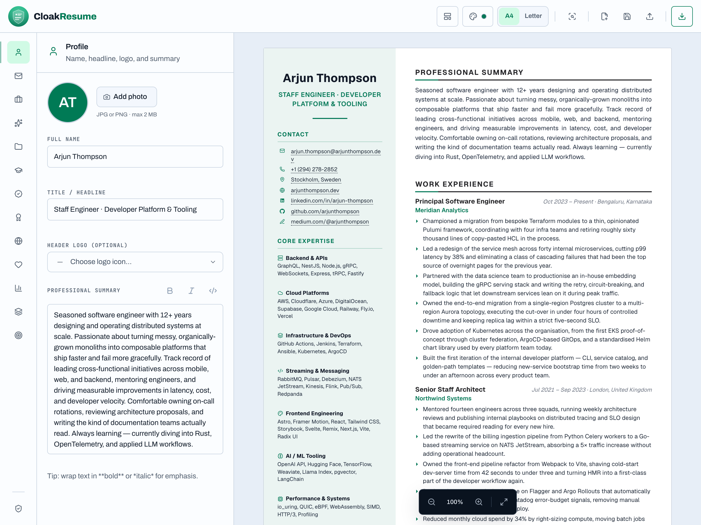

<div align="center">

  <p><strong>A complete résumé workbench. Nothing uploaded.</strong></p>
  <p>Build, tailor, review, and export a serious résumé in one browser tab.</p>

  <p><a href="https://resume.cloakyard.com/">resume.cloakyard.com</a></p>

  <p>
    <a href="https://opensource.org/licenses/MIT"></a>
    
    
  </p>

</div>

<p align="center">
  
</p>

---

## What it does

CloakResume is a browser-native editor for the complete résumé workflow:

- **Build** — edit profile, contact, experience, education, projects, skills, certifications, awards, languages, interests, tools, stats, extras, and custom sections.
- **Tailor** — keep a target job description beside the draft, review structure and keyword coverage, and run local writing checks with Harper.
- **Design** — choose from 15 live résumé layouts, set the template colour, reorder sections, and preview A4 or US Letter pages.
- **Carry** — export PDF, save or load editable JSON, start with realistic sample content, and return to a browser-saved local draft.

The application chrome follows the same technical-editorial language as
[CloakPDF](https://github.com/cloakyard/cloakpdf): Archivo and JetBrains Mono,
cool paper, slate rules, compact geometry, and solid overlays. CloakResume keeps its
own Emerald `#047857` identity. Résumé templates remain document outputs and preserve
their individual typography, palettes, and pagination behavior.

## Portable files

**Save** writes a versioned `.cloakresume.json` file containing the résumé, selected
template, document colour, paper size, and optional job description. **Load** checks
the CloakResume discriminator, normalises older or partial top-level résumé data, and
restores that workbench state. The JSON workflow was verified with a real browser
save→load round trip.

**Export PDF** renders the selected A4 or US Letter document locally. Exported pages
retain the template's visual layout while adding selectable text and link annotations.
Ordinary prose keeps natural word boundaries; emergency wrapping is reserved for
unbroken values such as URLs. The final A4 sample export was visually inspected across
all five pages and checked with independent PDF text and link extraction tools.

## Privacy and offline behavior

Résumé and job-description content is processed in the browser. The app has no résumé
upload endpoint, required account, analytics, or tracking integration. Drafts use
`localStorage`; JSON and PDF files are read or written directly on the user's device.

The browser still downloads static application assets from the site. A Content
Security Policy limits connections and executable resources to the application
origin. The installable PWA caches the application shell after it has loaded. Harper's
language engine is fetched on the first writing review and cached for later use,
subject to the browser's storage and eviction policies. A cold first visit therefore
still requires a network connection.

See [SECURITY.md](SECURITY.md) for the security boundary and disclosure guidance.

## Technology

| Area              | Technology                                                                                                    |
| ----------------- | ------------------------------------------------------------------------------------------------------------- |
| Application       | [React 19](https://react.dev/) + [TypeScript 7](https://www.typescriptlang.org/)                              |
| Styling           | [Tailwind CSS 4](https://tailwindcss.com/) + app-wide design tokens                                           |
| Build and tooling | [Vite+ (`vp`)](https://viteplus.dev/)                                                                         |
| Writing review    | [Harper](https://writewithharper.com/) WebAssembly in a dedicated worker                                      |
| PDF export        | [html2canvas-pro](https://github.com/yorickshan/html2canvas-pro) + [jsPDF](https://github.com/parallax/jsPDF) |
| PWA               | [vite-plugin-pwa](https://vite-pwa-org.netlify.app/) + Workbox                                                |

## Getting started

Requires Node.js 24 or newer and the Vite+ CLI.

```bash
npm install --global vite-plus
git clone https://github.com/cloakyard/cloakresume.git
cd cloakresume
vp install
vp dev
```

| Command                       | Purpose                                                       |
| ----------------------------- | ------------------------------------------------------------- |
| `vp install`                  | Install the locked dependency graph                           |
| `vp dev`                      | Start the development server                                  |
| `vp check`                    | Format, lint, and type-check with TypeScript 7                |
| `vp test`                     | Run the test suite                                            |
| `vp build`                    | Create the production bundle                                  |
| `vp preview`                  | Preview a production build                                    |
| `vp outdated`                 | Report packages with newer releases                           |
| `vp pm audit`                 | Audit the installed dependency graph                          |
| `vp run generate-icons`       | Regenerate favicon and install icons from the app-icon source |
| `vp run generate-og`          | Capture the 1200×630 social image from the live landing page  |
| `vp run generate-screenshots` | Capture the narrow and wide PWA screenshots                   |

## Project map

```text
cloakresume/
├── public/
│   ├── cloakresume-mark.svg  # Canonical 64px product mark and favicon source
│   ├── icons/                 # Favicons, install icons, and Open Graph image
│   └── screenshots/           # Narrow and wide PWA/README captures
├── src/
│   ├── components/            # Landing, editor chrome, controls, overlays, and review UI
│   │   ├── ats/               # ATS and writing-review panes
│   │   └── editor/            # Editors for every résumé section
│   ├── data/                  # Blank and realistic sample résumé generators
│   ├── templates/             # 15 output layouts and shared pagination helpers
│   ├── utils/                 # ATS, grammar, export, colour, storage, and rich-text logic
│   ├── App.tsx                # State and workflow composition
│   ├── cloak-family.css       # CloakPDF-family application language
│   └── index.css              # Base styles and Tailwind theme bridge
├── DESIGN.md                  # Authoritative layout and interaction contract
├── tokens.css                 # Runtime design-token source of truth
├── tokens.json                # Portable DTCG token export
├── docs/
│   ├── brand-assets.md        # Social/PWA asset source and regeneration workflow
│   └── design-audit.md        # Full app and component coverage audit
├── index.html                 # Metadata and CSP
├── vite.config.ts             # Vite+, PWA manifest, and Workbox configuration
└── package.json
```

## Design and asset references

- [DESIGN.md](DESIGN.md) defines the shared CloakPDF-family design language, Emerald identity, geometry, overlays, responsive behavior, and résumé-output boundary.
- [tokens.css](tokens.css) is normative at runtime; [tokens.json](tokens.json) is its portable token inventory.
- [docs/design-audit.md](docs/design-audit.md) records the complete 71-file TSX audit, lean-code sweep, completed browser/PDF checks, and release regression matrix.
- [docs/brand-assets.md](docs/brand-assets.md) records canonical OG, PWA screenshot, favicon, and launcher-asset dimensions plus the capture states used to generate them.
- [src/templates/TEMPLATE_INSTRUCTIONS.md](src/templates/TEMPLATE_INSTRUCTIONS.md) is the contract for résumé template coverage, pagination, accessibility, and ATS-safe output.

## Contributing and license

Contributions are welcome. Read [CONTRIBUTING.md](CONTRIBUTING.md) before changing
application chrome or résumé templates. CloakResume is licensed under the
[MIT License](LICENSE).

<p align="center">
  Built with care by <a href="https://github.com/sumitsahoo">Sumit Sahoo</a>
</p>
